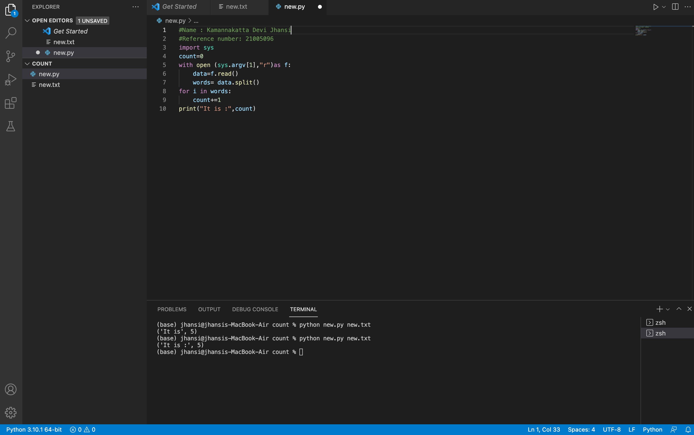

# command-line-arguments-to-count-word
## AIM:
To write a python program for getting the word count from the contents of a file using command line arguments.
## EQUIPEMENT'S REQUIRED: 
PC
Anaconda - Python 3.7
## ALGORITHM: 
### Step 1:
Import numpy
### Step 2: 
 Open using with keyword
### Step 3: 
Use split function to split words
### Step 4:  
store it in a variable
### Step 5: 
use for loop to proceed
### Step 6: 
print the result
## PROGRAM:
```
#Name : Kamannakatta Devi Jhansi
#Reference number: 21005096
import sys 
count=0
with open (sys.argv[1],"r")as f:
    data=f.read()
    words= data.split()
for i in words:
    count+=1
print("It is :",count) 
```
### OUTPUT:



## RESULT:
Thus the program is written to find the word count from the contents of a file using command line arguments.
